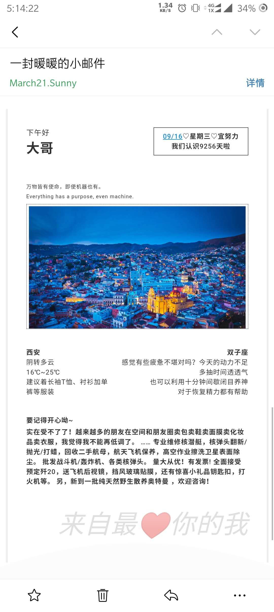

# SpringBoot 爱心小邮件
 
:heart: 每天定时发送一封暖心小邮件

调用聚合数据API，给指定的人定时发送邮件

- 日期
- 天气预报
- 星座运势
- 随机笑话
- 必应每日一图
- 每日一句

根据星座运势接口中的幸运指数生成echat雷达图，但是邮件中不能解析js中的数据；

所以使用PhantomJS把echart保存成base64图片，前端在进行调用。

邮件效果如下：

